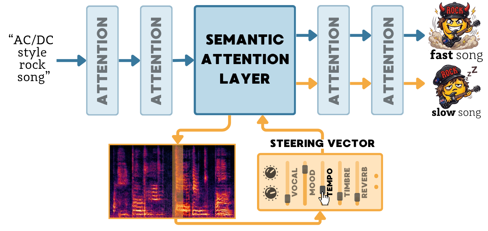

<div align="center">

# TADA! Tuning Audio Diffusion Models through Activation Steering

[](https://arxiv.org/abs/2602.11910)
[](https://www.python.org/)
[](LICENSE)
<p>
  <a href="https://huggingface.co/collections/lukasz-staniszewski/ace-step-audio-steering-suite-6a0bb3dacbac8e6db8f4d4e4">
    
  </a>  <a href="https://audio-steering.github.io">
    
  </a>
</p>

<p>
  
  <br>
  <sub>TLDR; We show where (through activation patching) and how (through benchmarking steering methods) to intervene Audio Diffusion Models for Musical Concept Modulation.</sub>
</p>

</div>

## ⚙️ Installation

1. Install with `uv`:

```bash
uv sync
source .venv/bin/activate
```

2. Copy the env template and set the project root:

```bash
cp .env.example .env
# Edit .env: set PROJECT_ROOT. HF token + cluster vars are optional.
set -a; source .env; set +a
```

3. Model checkpoints:
+ **ACE-Step weights** are downloaded to `${ACE_STEP_CACHE}`; **AudioLDM2 / Stable Audio Open** from HF.
+ **CLAP** (`music_audioset_epoch_15_esc_90.14.pt`) from [HF](https://huggingface.co/lukewys/laion_clap/tree/main):
    ```bash
    mkdir -p res/clap/pretrained
    wget -O res/clap/pretrained/music_audioset_epoch_15_esc_90.14.pt https://huggingface.co/lukewys/laion_clap/resolve/main/music_audioset_epoch_15_esc_90.14.pt
    ```

---

## 🔍 Localization

### Counterfactual prompt dataset

We release [`lukasz-staniszewski/patching-music-musiccaps-prompts`](https://huggingface.co/datasets/lukasz-staniszewski/patching-music-musiccaps-prompts) — counterfactual prompt pairs over 21 musical features.

To load:
```python
from datasets import load_dataset

ds = load_dataset("lukasz-staniszewski/patching-music-musiccaps-prompts")
violin_rows = ds["train"].filter(lambda r: r["original_feature"] == "violin")
print(violin_rows[0])
# {'original_feature': 'violin',
#  'clean_prompt':     'A folk piece with violin and ...',
#  'corrupted_prompt': 'A folk piece with trumpet and ...'}
```

Each row contains: `original_feature`, `clean_prompt` (from MusicCaps), and `corrupted_prompt`. Feature words and replacements are in `src/preprocess/features.py`.

#### Regenerating the MusicCaps prompts

To rebuild the CSV locally, edit `src/preprocess/features.py`, download the [MusicCaps](https://www.kaggle.com/datasets/googleai/musiccaps) caption file from the [HuggingFace mirror](https://huggingface.co/datasets/google/MusicCaps) and place it at `data/music_caps.csv`:

```bash
mkdir -p data
wget -O data/music_caps.csv https://huggingface.co/datasets/google/MusicCaps/resolve/main/musiccaps-public.csv
```

Then run:

```bash
python src/preprocess/prepare_prompts.py \
    --input_file data/music_caps.csv \
    --limit 256 \
    --output_file data/generated_prompts.csv
```

To republish on the Hub afterwards:

```bash
python scripts/hub/push_localization_prompts.py \
    --repo-id {repo_id}/patching-music-musiccaps-prompts \
    --csv data/generated_prompts.csv
```

### Running activation patching

The patching driver is `src/patch_layers.py`, configured via Hydra. The main config is `configs/generate_audio_patch.yaml`, per-architecture: `configs/patch_model/<arch>_patch.yaml`. After generation, `src/eval_audio.py` computes CLAP / MUQ-T metrics over the patched audio.

### Per-architecture examples

#### ACE-Step

```bash
# 1. Generate patched audio (one block per run, then aggregate).
python src/patch_layers.py \
    patch_model=ace_patch \
    patch_config=ace \
    patch_data=musiccaps/violin_ace \
    patch_layers=ace/tf7 \
    paths.output_dir=outputs/ace/patching/violin/tf7

# prompt_limit=2 for low scale tests

# 2. Score CLAP / MUQ-T against the clean baseline.
bash sh_scripts/localization/eval_feature_ace.sh violin violin_summary none tf5 tf6 tf7 all
```

Browse `configs/patch_layers/ace/` for available `patch_layers` presets.

#### AudioLDM 2

```bash
python src/patch_layers.py \
    patch_model=audioldm2_patch \
    patch_data=musiccaps/violin \
    patch_layers=audioldm2/up1tf5 \
    paths.output_dir=outputs/audioldm2/patching/violin/up1tf5

bash sh_scripts/localization/eval_feature_audioldm2.sh violin violin_summary up1tf5
```

Browse `configs/patch_layers/audioldm2/` for available `patch_layers` presets.

#### Stable Audio Open

```bash
python src/patch_layers.py \
    patch_model=stableaudio_patch \
    patch_config=stableaudio \
    patch_data=musiccaps/violin \
    patch_layers=stableaudio/tf11 \
    paths.output_dir=outputs/stableaudio/patching/violin/tf11

bash sh_scripts/localization/eval_feature_stableaudio.sh violin violin_summary tf11
```

Browse `configs/patch_layers/stableaudio/` for available `patch_layers` presets.


---

## 🎛️ Activation Steering

Every method shares the same interface.

A typical workflow: **(1)** compute steering artifacts once with `src/steering/run_compute.py` and **(2)** sweep alphas with `src/steering/run_eval.py`. Both accept `--config <path.yaml>` — see [`configs/steering/`](configs/steering/).

| Method | What it does | Needs compute step? | Wrapper |
|---|---|---|---|
| [PCI](#pci) | Switch to positive/negative prompt for the last \|α\| diffusion steps | no | `PCISteeringController` |
| [Text Embeddings](#text-embeddings) | Interpolate in T5 embedding space | no | `TextEmbSteeringController` |
| [Token Embeddings](#token-embeddings) | Per-concept direction at the concept-token position | yes | `TokEmbSteeringController` |
| [FreeSliders](#freesliders) | 3-pass noise blending past `split_step` | no | `FreeSlidersSteeringController` |
| [Concept Sliders](#concept-sliders) | LoRA adapter trained with the Concept-Sliders loss | yes | `ConceptSlidersSteeringController` |
| [AUSteer](#austeer) | Sparse activation-momentum scoring over freq bins | yes | `AUSteerSteeringController` |
| [CAA](#caa) | Contrastive Activation Addition (mean-diff steering vector) | yes | `CAASteeringController` |
| [SAE](#sae) | Sparse-autoencoder feature interventions | yes | `SAESteeringController` |

Pretrained artifacts live in the [**TADA Steering Collection**](https://huggingface.co/collections/lukasz-staniszewski/tada-steering-collection). Every example below uses `concept="piano"`; pass `target_layers="tf6tf7"` (or any list of block names) to restrict to localized layers.

---

### Prompt Conditioned Intervention (PCI)

```python
from src.steering import SteerableACEModel, PCISteeringController

model = SteerableACEModel(device="cuda"); model.pipeline.load()
ctrl = PCISteeringController(concept="piano", alpha=5)
with model.steer(ctrl):
    audio = model.generate(prompt="instrumental music", lyrics="[inst]",
                           audio_duration=10.0, infer_step=30, manual_seed=0)
```

### Text Embeddings (TextEmb)

```python
from src.steering import SteerableACEModel, TextEmbSteeringController

model = SteerableACEModel(device="cuda"); model.pipeline.load()
ctrl = TextEmbSteeringController(concept="piano", alpha=0.8, te_split_step=3)
with model.steer(ctrl):
    audio = model.generate(prompt="instrumental music", lyrics="[inst]",
                           audio_duration=10.0, infer_step=30, manual_seed=0)
```

### Token Embeddings (TokEmb)

```python
from src.steering import SteerableACEModel, TokEmbSteeringController

model = SteerableACEModel(device="cuda"); model.pipeline.load()
ctrl = TokEmbSteeringController.from_pretrained(
    "lukasz-staniszewski/ace-step-tokemb-piano", alpha=1.0, te_split_step=3,
)
with model.steer(ctrl):
    audio = model.generate(prompt="instrumental music", lyrics="[inst]",
                           audio_duration=10.0, infer_step=30, manual_seed=0)
```

Compute your own: `python src/steering/run_compute.py --config configs/steering/ace/tokemb/compute_piano.yaml`.

### FreeSliders (FreeSliders)

```python
from src.steering import SteerableACEModel, FreeSlidersSteeringController

model = SteerableACEModel(device="cuda"); model.pipeline.load()
ctrl = FreeSlidersSteeringController(concept="piano", alpha=2.0, split_step=3)
with model.steer(ctrl):
    audio = model.generate(prompt="instrumental music", lyrics="[inst]",
                           audio_duration=10.0, infer_step=30, manual_seed=0)
```

### Concept Sliders (CS)

```python
from src.steering import SteerableACEModel, ConceptSlidersSteeringController

model = SteerableACEModel(device="cuda"); model.pipeline.load()
ctrl = ConceptSlidersSteeringController.from_pretrained(
    "lukasz-staniszewski/ace-step-cs-piano-r8-all", alpha=1.0,
)
with model.steer(ctrl):
    audio = model.generate(prompt="instrumental music", lyrics="[inst]",
                           audio_duration=10.0, infer_step=30, manual_seed=0)
```

Train your own:

```bash
python src/steering/run_compute.py \
    --scorer concept_slider --concept piano --no-model \
    --output steering_vectors/concept_slider/ace_piano_r8_eta7_500_all \
    --scorer-kwargs '{"iterations":500,"eta":7,"layers":"all"}'
```

### AUSteer

```python
from src.steering import SteerableACEModel, AUSteerSteeringController

model = SteerableACEModel(device="cuda"); model.pipeline.load()
ctrl = AUSteerSteeringController.from_pretrained(
    "lukasz-staniszewski/ace-step-austeer-piano-all", alpha=15.0,
)
with model.steer(ctrl):
    audio = model.generate(prompt="instrumental music", lyrics="[inst]",
                           audio_duration=10.0, infer_step=30, manual_seed=0)
```

Compute your own:

```bash
python src/steering/run_compute.py \
    --scorer austeer --concept piano --no-model \
    --output steering_vectors/austeer/ace_piano_all \
    --scorer-kwargs '{"layers":"all","num_inference_steps":30,"guidance_scale":5.0,"seed":10}'
```

### Contrastive Activation Addition (CAA)

```python
from src.steering import SteerableACEModel, CAASteeringController

model = SteerableACEModel(device="cuda"); model.pipeline.load()
ctrl = CAASteeringController.from_pretrained(
    "lukasz-staniszewski/ace-step-caa-piano", alpha=20.0,
)
with model.steer(ctrl):
    audio = model.generate(prompt="instrumental music", lyrics="[inst]",
                           audio_duration=10.0, infer_step=30, manual_seed=0)
```

Compute your own: `python src/steering/run_compute.py --config configs/steering/ace/caa/compute_piano.yaml`.

### Sparse Autoencoder (SAE)

Two SAEs (one per hookpoint) + per-concept score tables, blended via top-tau features per diffusion step.

```python
from src.steering import SteerableACEModel, SAESteeringController, LayerSpec
from src.steering.methods.sae import load_features_from_score_cache
from src.steering.methods.sae.lib.sae.sae import Sae

model = SteerableACEModel(device="cuda"); model.pipeline.load()

sae_tf7 = Sae.load_from_hub(
    "lukasz-staniszewski/ace-step-sae-tf7-cross-attn",
    hookpoint="transformer_blocks.7.cross_attn", device="cuda",
)
sae_tf6 = Sae.load_from_hub(
    "lukasz-staniszewski/ace-step-sae-tf6-cross-attn",
    hookpoint="transformer_blocks.6.cross_attn", device="cuda",
)

top20_tf7 = load_features_from_score_cache(
    "lukasz-staniszewski/ace-step-sae-scores-piano",
    score_filename="tf7_scores.pkl", top_k=20,
)
top20_tf6 = load_features_from_score_cache(
    "lukasz-staniszewski/ace-step-sae-scores-piano",
    score_filename="tf6_scores.pkl", top_k=20,
)

ctrl = SAESteeringController({
    "transformer_blocks.7.cross_attn": LayerSpec(
        sae=sae_tf7, features_per_timestep=top20_tf7,
        intervention_mode="steering_vector", multiplier=10.0,
    ),
    "transformer_blocks.6.cross_attn": LayerSpec(
        sae=sae_tf6, features_per_timestep=top20_tf6,
        intervention_mode="steering_vector", multiplier=10.0,
    ),
})
with model.steer(ctrl):
    audio = model.generate(prompt="instrumental music", lyrics="[inst]",
                           audio_duration=10.0, infer_step=30, manual_seed=0)
```

Compute your own — per-concept feature-selection scores (`tf{6,7}_scores.pkl`):

```bash
python src/steering/run_compute.py --config configs/steering/ace/sae/compute_piano.yaml
# → steering_vectors/sae/ace_piano/{tf7_scores.pkl, tf6_scores.pkl}
```

To train the SAEs themselves first — cache activations, then train:

```bash
python src/steering/run_compute.py \
    --scorer sae-activations --output activations/ace_piano \
    --scorer-kwargs '{"hook_names":["transformer_blocks.7.cross_attn","transformer_blocks.6.cross_attn"],
                     "dataset_name":"data/music_caps.csv","audio_length_in_s":10.0}'

python -m src.steering.methods.sae.lib.scripts.train_ace --help
```

### Other architectures: AudioLDM2 and Stable Audio Open

We share CAA implementation for other two backbones, each with its own controller and
HF steering vectors for the four concepts: piano, female vocal, tempo, mood.

```python
from src.steering import SteerableAudioLDMModel, AudioLDMCAASteeringController

model = SteerableAudioLDMModel(device="cuda")
ctrl = AudioLDMCAASteeringController.from_pretrained(
    "lukasz-staniszewski/audioldm2-caa-piano", alpha=2.0,
)
with model.steer(ctrl):
    audio = model.generate(prompt="instrumental music", num_inference_steps=100,
                           audio_length_in_s=10.0, guidance_scale=4.5, seed=0)
```

```python
from src.steering import SteerableStableAudioModel, StableAudioCAASteeringController

model = SteerableStableAudioModel(device="cuda")
ctrl = StableAudioCAASteeringController.from_pretrained(
    "lukasz-staniszewski/stable-audio-caa-piano", alpha=2.0,
)
with model.steer(ctrl):
    audio = model.generate(prompt="instrumental music", num_inference_steps=100,
                           audio_length_in_s=10.0, guidance_scale=7.0, seed=0)
```

Steer only the localized blocks by passing the layer set the localization scan found
(`target_layers` param):

```bash
# all blocks / localized blocks, over the paper's 16-point alpha grid
python src/steering/run_eval.py --config configs/steering/audioldm2/audioldm_caa/eval_piano.yaml
python src/steering/run_eval.py --config configs/steering/audioldm2/audioldm_caa/eval_loc_piano.yaml
python src/steering/run_eval.py --config configs/steering/stable_audio/stable_audio_caa/eval_loc_piano.yaml
```

Compute your own vectors for any of the nine concepts (this is what produced the Hub
artifacts above):

```bash
python src/steering/run_compute.py --config configs/steering/audioldm2/audioldm_caa/compute_violin.yaml
# -> steering_vectors/caa_audioldm2/audioldm_violin_allTrue_normTrue_all
```

---

## 📊 Evaluation

Experiments have a corresponding YAML config in `configs/steering/`.

### Per-method alpha sweep

```bash
python src/steering/run_eval.py --config configs/steering/ace/caa/eval_loc_piano.yaml
# → outputs/eval/caa_loc_piano/{run_config.json, alpha_<value>/audios.npz}
```

Methods have eval variants: `eval_all_<concept>.yaml` (steer all attn layers),
`eval_loc_<concept>.yaml` (steer localized layers), `eval_ablated_<concept>.yaml`
(CAA only, steer all except localized).

Every hparam in the YAML is also a CLI flag, see `configs/steering/ace/caa/eval_piano_custom.yaml` for an annotated template.

### Compute concept-alignment + preservation metrics

`src/steering/eval/eval_steering_protocol.py` computes CLAP, MUQ-T, LPAPS, and Audiobox aesthetics for one sweep directory and writes `protocol_results/` next to it.

```bash
python src/steering/eval/eval_steering_protocol.py \
    --steering_dir outputs/eval/caa_piano \
    --concept piano
```

### Metrics: AUC, Smoothness, Audio Quality

`src/steering/eval/auc.py` aggregates per-method results into tables:

- **AUC** — area under the preservation--alignment curve
- **Smoothness** — std of consecutive alignment differences across alphas
- **Audio Quality** — Audiobox Aesthetics (CE / CU / PC / PQ) at steering points

```bash
# Compare all 8 methods on one concept (each path is a protocol_results/ dir).
python src/steering/eval/auc.py \
    "outputs/eval/{caa,sae,austeer,concept_slider,freesliders,textemb,pci,tokemb}_piano/protocol_results" \
    --direction both \
    --auto_label
```

### Reproducing the paper's numbers

[`results/`](results/README.md) dir contains per-alpha metrics — Alignment (MuQ,
CLAP), Quality, and Preservation (LPAPS, Harmony, Melody, Rhythm, Ssm) — and
layer-impact scores. Scripts reproduce paper's outputs:

```bash
# Per-concept tables + the average over all nine concepts.
python scripts/results/make_tables.py --out tables.md
python scripts/results/make_tables.py --axis harmony      # a decomposed axis
python scripts/results/make_tables.py --localization      # layer impact I(l)

# Preservation vs delta-alignment curves; the shaded area is the reported AUC.
python scripts/results/plot_curves.py
```

For a single-method or single-direction breakdown, pass `--direction pos` or `--direction neg`.

---

## 🙏 Credits

This repository builds on: [ACE-Step](https://github.com/ace-step/ACE-Step), [DDPM Inversion for Audio](https://github.com/HilaManor/AudioEditingCode), [CASteer](https://github.com/Atmyre/CASteer), [Universal DiffSAE](https://github.com/cywinski/universal-diffsae).

## 📚 BibTeX

```bibtex
@article{staniszewski2026tada,
  title={TADA! Tuning Audio Diffusion Models through Activation Steering},
  author={Staniszewski, {\L}ukasz and Zaleska, Katarzyna and Modrzejewski, Mateusz and Deja, Kamil},
  journal={arXiv preprint arXiv:2602.11910},
  year={2026}
}
```